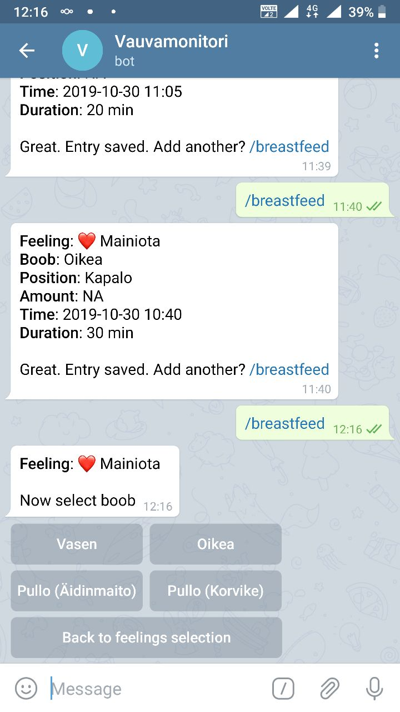

# Introduction

A telegram bot for keeping count of breastfeeding using inline buttons.

The idea is to send this data to some database and analyze it further,
e.g. count how many times breastfed and intervals etc.

My implementation used InfluxDB to store and Grafana to visualize the data.



## Install


Create telegram bot using BotFather and then put the your bot API-token to `main.py` or docker-compose `TG_API_KEY` environment variable and run

```
docker-compose up -d
```

## Troubleshooting

If not using docker, please do check you are using at least Python 3.8
